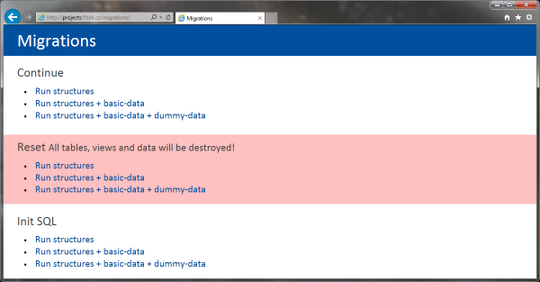

# Nextras Migrations

V tomto příkladu si ukážeme, jak použít Lean Mapper společně s [Nextras\Migrations](https://nextras.org/migrations/). Nextras\Migrations sice Lean Mapper přímo nepodporují, ale obsahují podporu pro Dibi, nad kterým je Lean Mapper postaven.


## Příprava

Nejprve si Nextras\Migrations nainstalujeme, konkrétně použijeme RC verzi chystané verze 3.1:

```
composer require nextras/migrations ^3.1@RC
```

V dalším kroku si připravíme adresářovou strukturu, do kterého budeme ukládat jednotlivé migrační SQL soubory. Vycházet budeme z doporučené adresářové struktury - vytvoříme si tedy složku [`migrations`](migrations/) a v ní podsložky `basic-data`, `dummy-data` a `structures`:

* `migrations`
	* `basic-data` - data pro vývoj i produkci
	* `dummy-data` - data pro vývoj na localhostu
	* `structures` - migrace pro vytvoření a úpravy tabulek, sloupců,... a pro migrace dat


## Použití

Následně si vytvoříme ve složce `migrations` skript [`run.php`](migrations/run.php) - přes něj budeme ovládat zpracování migrací.

```php
<?php

use Nextras\Migrations\Bridges;
use Nextras\Migrations\Controllers;
use Nextras\Migrations\Drivers;
use Nextras\Migrations\Extensions;

require __DIR__ . '/vendor/autoload.php';

$conn = new LeanMapper\Connection(array(
	'driver'   => 'mysqli',
	'host'     => 'localhost',
	'username' => 'root',
	'password' => '***',
	'database' => 'mydatabase',
));
$dbal = new Bridges\Dibi\Dibi3Adapter($conn);
$driver = new Drivers\MySqlDriver($dbal);

$controller = php_sapi_name() === 'cli'
	? new Controllers\ConsoleController($driver)
	: new Controllers\HttpController($driver);

$baseDir = __DIR__;
$controller->addGroup('structures', "$baseDir/structures");
$controller->addGroup('basic-data', "$baseDir/basic-data", array('structures'));
$controller->addGroup('dummy-data', "$baseDir/dummy-data", array('basic-data'));
$controller->addExtension('sql', new Extensions\SqlHandler($driver));

$controller->run();
```

Pokud nyní v prohlížeči otevřeme soubor `migrations/run.php`, zobrazí se nám toto webové rozhraní:




## Použití v Nette

V rámci Nette aplikace můžeme skript `run.php` trochu zjednodušit a objekt `LeanMapper\Connection` získat z [DI kontejneru](https://doc.nette.org/cs/2.4/dependency-injection). Skript upravíme do této podoby:

```php
<?php

use Nextras\Migrations\Bridges;
use Nextras\Migrations\Controllers;
use Nextras\Migrations\Drivers;
use Nextras\Migrations\Extensions;

$container = require __DIR__ . '/../app/bootstrap.php';

$conn = $container->getByType('LeanMapper\Connection');
$dbal = new Bridges\Dibi\Dibi3Adapter($conn);
$driver = new Drivers\MySqlDriver($dbal);

$controller = php_sapi_name() === 'cli'
	? new Controllers\ConsoleController($driver)
	: new Controllers\HttpController($driver);

$baseDir = __DIR__;
$controller->addGroup('structures', "$baseDir/structures");
$controller->addGroup('basic-data', "$baseDir/basic-data", array('structures'));
$controller->addGroup('dummy-data', "$baseDir/dummy-data", array('basic-data'));
$controller->addExtension('sql', new Extensions\SqlHandler($driver));

$controller->run();
```
